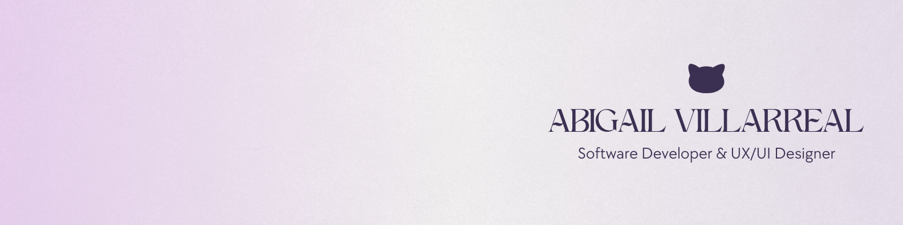

<h1 align="center">𝙬𝙚𝙡𝙘𝙤𝙢𝙚 𝙩𝙤 𝙢𝙮 𝙨𝙥𝙖𝙘𝙚 🪐</h1>

  

  <b>Software Developer  🚀 | UX/UI Designer  🎨 | Lifelong Learner 💡</b>
   
  <i>"Building intuitive systems and crafting cool user experiences"</i>

  
  
  

---

### 🚀 What I'm all about
I am a **Full Stack Developer** and **UX/UI Designer** based in Peru. My journey is fueled by a commitment to excellence and the drive to provide the best possible experience for the end-user.

- 💡 **Self-Taught Spirit:** Although I have a background in software development, I am a **lifelong learner** who evolves every day, constantly mastering new technologies and design trends.
- 🔭 **Current Focus:** Elevating a logistics information system for **Acuarius Logistic** with high-end performance and intuitive UI.
- 🏢 **Future Vision:** Currently building the foundations for my own **Web Agency**, focusing on delivering premium digital products that merge technical power with cool designs.
- 🌱 **Growth Mindset:** Refining my mastery in **Full Stack** ecosystems and advanced **UX** research to lead high-impact projects.

---

### 🛠 My Digital Toolbox

**Languages & Core Tech**

      

**Frontend**

      

**Backend**

   

**Databases**

   

**CMS & E-commerce**

   

**🎨 Design Tools**

     

---

### 📊 Performance & Activity
  

---

### 🎵 Current Mood

  

  

